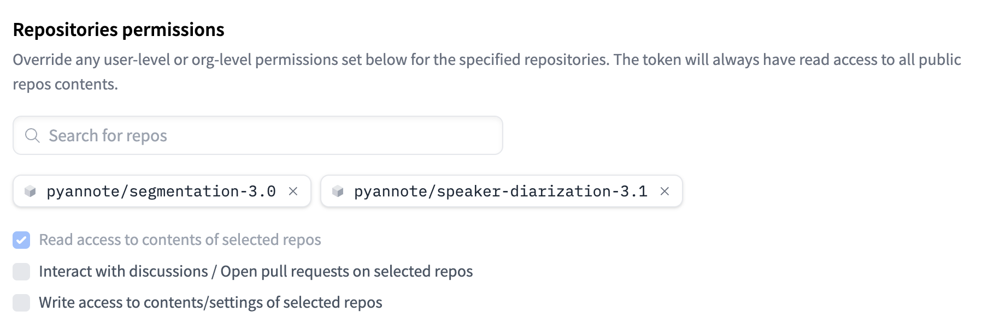
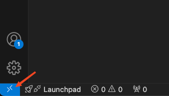
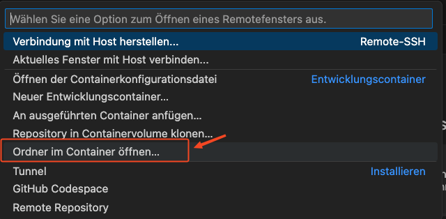

# OOP25_Notebook

## Meeting Room 
Join the [Teams Meeting](https://teams.microsoft.com/l/meetup-join/19%3ameeting_NDc2OTBjZmQtZjIxNS00ZTBmLTgyN2ItZjI1NWY2ZjJmODBl%40thread.v2/0?context=%7b%22Tid%22%3a%22531a3b09-144b-4e5e-9451-968aa3f67210%22%2c%22Oid%22%3a%224c79b2b2-c8d5-46c4-9cad-e6fb49a1f08e%22%7d). We use the meeting chat to exchange code snippets and share links. 

## Prerequisites
### Clone repo with https
Install [git](https://git-scm.com/downloads) if you don't already have it, then: 

```
git clone https://github.com/hiqs-gmbh/OOP25_Notebook.git
```


### Docker Desktop
Install [Docker Desktop](https://docs.docker.com/compose/install/) if you don't already have it, then: 


### VsCode Extensions
#### Docker 
Install [Visual Studio Code](https://code.visualstudio.com/download) if you don't already have it, then install **Docker Extension**: 


#### Dev Containers
Then install **Dev Containers Extension**: 


### Copy `.env.example`  into `.env`
Create an `.env` file on the same level as the `.env.example` and copy the entire content of the `.env.example` into your new `.env`.

### Hugging Face Token
A [Hugging Face Token](https://huggingface.co/settings/tokens) is required to be able to download the Pyannote AI model.

Create an account first on [https://huggingface.co/join](https://huggingface.co/join).

Then go to Settings and Tokens and generate an Access Token. Then add this to the `.env` under ```PYANNOTE_HF_TOKEN```. 

If you wish, you can restrict the rights of your token (when selecting the ```Fine Grained``` type) to the following repositories.



## Starting containers for development
### Ollama (LLM Inference Server)

Start the ```docker-compose.yml``` via `docker compose up`or through the Docker Extension in VSCode


> [!NOTE]
> Make sure Docker Desktop is running and you are not inside the Dev Container (next step).

### Dev Container
**Click button at the bottom left of VSCode**



**Open current folder in Dev Container**




### First steps in container
Open the `multi-agent/foundation/download_models.ipynb` Notebook and run all cells. 

> [!NOTE]
> Make sure you selected a Python Kernel before you run the cells in the notebook.


