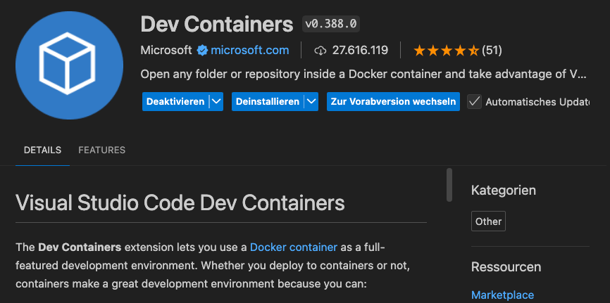

# OOP25_Notebook

## Prerequisites

### Clone repo with https
Clone with https (must have to develop inside container).

`git clone [https://code.hiqs.de/HIQSLabAI/OOP25_Notebook.git](https://github.com/hiqs-gmbh/OOP25_Notebook.git)`. 

### Install Dev Container Extension 

### Startup Container
**Click button at the bottom left of VSCode**

**Open current folder in Container**

## LFS
`sudo apt install git-lfs`

In Repo 
`git lfs install`

Dateien anhand Endungen tracken
`git lfs track "*.mp3"`

## Hugginface

# To Do
Folien erstellen mit Begrifflichkeiten
Was mein ich mit State
Was ist eine Chain
etc... 
zum folgen

was ist Multi Agent

Docker compose muss außerhalb des Dev Containers gestartet werden

am besten in neuem fenster
- wie installiere ich zur not docker befehle?
- in vscode extension auch möglich? dann über datei klick

## Setup
run download-model.ipynb
kopiere .env.example in neue .env
